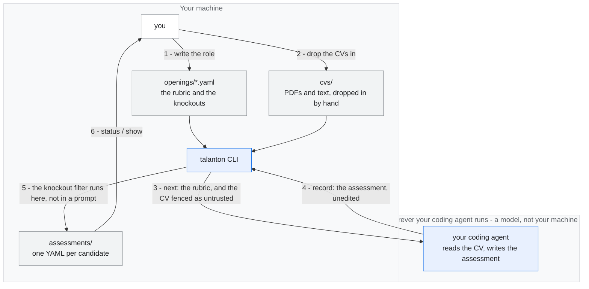
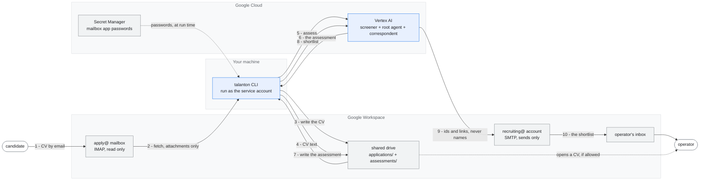
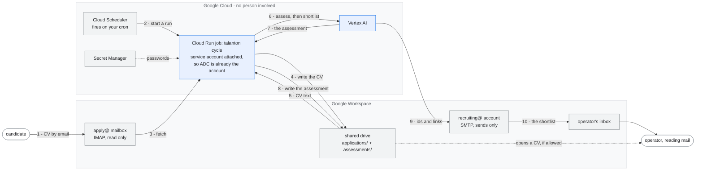

# The three ways to run talanton

Same engine, same rubric, same filter. What changes is **who does the
assessing**, **where the files live**, and **who starts a run**.

Read the boxes as boundaries. Each one is a system somebody else operates, and
every arrow crossing a boundary is candidate data leaving one place for
another.

---

## Mode 1 — local. A coding agent assesses, and nothing leaves the machine

No cloud, no mailbox, no model configured, nothing billed. CVs go in a folder
and a coding agent reads them.



**No Google service is involved, no credential is needed, and nothing here can
send to anybody.** `talanton` itself makes no model call: there is no Vertex
project, no API key, and nothing is billed to you.

But be precise about the second boundary, because it is easy to read this mode
as "the CV never leaves the room". It does. Your coding agent is a model, and
step 3 hands it the CV text, so the file goes to whichever provider runs that
agent under whatever terms you have with them. That is a smaller and more
controllable exposure than a screening pipeline — one CV at a time, at your
keystroke, to a provider you already chose — but it is not none, and a
candidate would not consider it none.

---

## Mode 2 — attended. Real mailboxes, shared storage, a model

Applications arrive by email. Files live on a shared drive so more than one
person can read them. A model screens them. **A person still starts every run**,
from their own machine.



Three things the picture is meant to show:

- **The two mailboxes are separate accounts.** The side that reads applications
  cannot send, and the side that sends has no access to the mailbox. If the
  sending identity were ever misused, it could not read a single CV.
- **Nothing reaches a candidate.** The only outbound arrow ends at the
  operator's inbox. There is no tool that takes a candidate as a recipient.
- **What is emailed carries ids and links, never names.** Who may learn an
  identity is decided by who can open the file on the drive.

---

## Mode 3 — automated. It runs on GCP, on a schedule, with nobody present

The same stages, moved off the laptop. **The laptop is gone from the diagram,
and that is the whole difference.**



An assessment-only variant deploys `assessor_app` instead. It holds no tool
that can reach anybody, so nothing is emailed at all and a person reads the
assessments on the drive. That is the right thing to run unattended.

---

## How you change between them

### Mode 1 to Mode 2: a configuration change

All of it is in `talanton.toml`, plus who you are when you run it.

| | Mode 1 | Mode 2 |
|---|---|---|
| `[storage.cvs]`, `[storage.assessments]` | `backend = "local"` | `backend = "gdrive"` and a `folder_id` |
| `[screening]` | absent | `project`, `location = "global"`, `model` |
| `[mail.inbound]` | absent | `user`, `password_secret` |
| `[mail.outbound]` | absent | `user`, `password_secret`, `operators`, `allow_domains` |
| identity | your own login | the service account, impersonated |
| what assesses | your coding agent | the screener, on Vertex |
| commands | `next`, `record` | `fetch`, `assess`, `shortlist`, `cycle` |

Two of those rows are the ones people get wrong.

**`location` is `global`.** No Gemini model is served from any `europe-west`
region: a regional value returns 404 rather than falling back. Storage can
still be pinned to Zurich, screening cannot, and the gap between those two is a
data-protection decision worth making deliberately rather than discovering.

**Identity is not a detail.** Run as the service account, not as yourself:

```bash
gcloud auth application-default login --impersonate-service-account=$SA
```

Google Drive's `drive.file` scope reaches only files that identity created, so
a CV fetched under a personal login is one that only that person's talanton can
read. Everybody else gets an empty pipeline and no error. See *Whose identity
talanton runs as* in [`AGENTS.md`](../AGENTS.md).

Leave `dry_run = true` until somebody has watched a full run and read what it
would have sent. `talanton check` says loudly when it is off.

### The rows are independent, and one combination deserves a name

The table above reads like a ladder. It is not: storage backend, mailbox,
who assesses and who triggers are four independent settings, and the code
treats them that way. Any combination is valid.

The one worth naming is **shared storage with no model**: `backend = "gdrive"`
with `[screening]` absent. Real Drive folders, so more than one person can read
a CV and access is a membership list — and a coding agent doing the assessing,
so there is no Vertex project, no model id, and nothing billed. For a small
team that is often the most useful cell in the grid.

| | value |
|---|---|
| `[storage.cvs]`, `[storage.assessments]` | `backend = "gdrive"` and a `folder_id` |
| `[screening]` | absent |
| `[mail.inbound]` | optional — `fetch` works with no model |
| `[mail.outbound]` | optional — needed only for `send` |
| what assesses | your coding agent, through `next` and `record` |

The loop is `fetch` → `next` → read it → `record` → `status` → `send`. Nothing
is weakened by taking it: `record` runs the same knockout filter as the agent
path, `send` runs the same name check, and `talanton check` passes on this
shape — a missing model is reported as a note, not a failure.

Two things carry over that people miss.

**Identity still decides what you can see.** Everything under *Identity is not
a detail* above applies here, model or no model. `drive.file` reaches only the
files the calling identity created, so fetching as the service account and then
running `next` as yourself gives "nothing waiting" and no error.

**Mode 1's privacy note does not carry over.** CVs are on Drive now, which is
the point of choosing this cell. And the part about your coding agent being a
model applies exactly as it does in mode 1.

### Mode 2 to Mode 3: not a configuration change at all

Same config file. What changes is **where the process runs** and **how it gets
its identity**:

| | Mode 2 | Mode 3 |
|---|---|---|
| where it runs | your laptop | Cloud Run, GCE, GKE, or Agent Engine |
| how it gets its identity | you impersonate the service account | the account is **attached**, so ADC is already it |
| logging in | again whenever the token expires | never |
| what starts a run | you type a command | Cloud Scheduler, or `cycle --watch` on IMAP IDLE |

This is why the identity work matters more than it looks. A deployment resting
on a human token cannot run unattended, because recovering that token needs a
person, a browser and a password.

```bash
# the whole agent, including the send path
adk deploy agent_engine --project=$GOOGLE_CLOUD_PROJECT \
  --region=$GOOGLE_CLOUD_LOCATION --display_name="Talanton" talanton
```

The stages also deploy separately, each with only the privileges it needs:
`fetch` needs the mailbox and cannot send, `assess` needs the two locations and
Vertex, `shortlist` needs the sending account. Deploying `assessor_app` gives
you the first two with no send path anywhere in the process.
